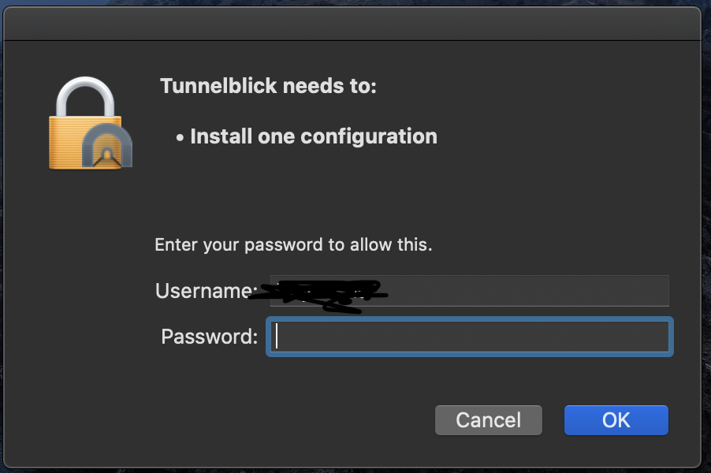

# Configuring IITD VPN
This article aims to serve as a quick and easy guide for anyone wanting to configure the IITD VPN for use to access internal IIT Delhi sites from outside the campus.
Note - This article was originally made by me and Priyanshu Gautam as pre TA work for COL106 course, held in the online semester 2020-21. Slides included.

# Table of Contents
1. [Requesting your VPN credentials](#request)
2. [Windows Configuration](#windows)
3. [Linux Configuration](#linux)
4. [MacOS Configuration](#mac)

# Requesting your VPN credentials <a name="request"></a>

Please refer the following link for more information: [https://csc.iitd.ac.in/services-network-vpn.php](https://csc.iitd.ac.in/services-network-vpn.php)

- Write an email to [sysadm@cc.iitd.ac.in](mailto:sysadm@cc.iitd.ac.in) from your institute email id. Subject can be "VPN Request - {entry number}".
- Mention the purpose for which you require VPN access and send.  
**NOTE**: In the times of COVID when the institute is in lockdown, you dont need a faculty supervisor to approve a VPN, but that is not the case right now. Till 1st May, 2021, all students are entitled to a VPN, irrespective of having a faculty supervisor or no.
- You should get a reply within 24 hours with instructions for setup and use. Download the certificates and client depending on your OS:
- For Windows: Use [OpenVPN](https://openvpn.net/index.php/open-source/downloads.html)
- For MacOS: Use [TunnelBlick](https://www.tunnelblick.net/downloads.html)
- Linux *superuser master-race* can configure settings from [native clients directly](https://www.linux.com/learn/install-and-configure-openvpn-server-linux)

# Windows Configuration <a name="windows"></a>
Download [OpenVPN](https://openvpn.net/index.php/open-source/downloads.html) for windows on your PC and install in a directory of your choice.

- Post installation, Download "yourID.crt", "yourID.key", Pre-shared server key "ta.key", client configuration file "client.ovpn" from the mailed link and IITD CA certificate "CCIITD\_CA.crt" from [CSC website](http://www.cc.iitd.ac.in/CSC/index.php?option=com_content&view=article&id=53&Itemid=57) or [this repository](NEWCCIITD-CA.crt) to `C:\Progam Files\OpenVPN\config` directory (or your own installation directory)
- Right click on OpenVPN GUI and click run as administrator
- Open the GUI system tray and right click on the ovpn client, and click connect. Enter your kerberos credentials (same as moodle credentials) in the prompt.

1. Start the Client  

2. Enter your kerberos credentials  

3. Done, connect to VPN


That's it. Test your connection by visiting internal sites like [https://eadmin.iitd.ac.in/] or [https://ecertification.iitd.ac.in/]

# Linux Configuration <a name="linux"></a>
Make sure you have OpenVPN, along with the GUI installed: 
```sudo apt-get install network-manager-openvpn openvpn```

- Post installation, Download "yourID.crt", "yourID.key", Pre-shared server key "ta.key", client configuration file "client.ovpn" from the mailed link and IITD CA certificate "CCIITD\_CA.crt" from [CSC website](http://www.cc.iitd.ac.in/CSC/index.php?option=com_content&view=article&id=53&Itemid=57) or [this repository](NEWCCIITD-CA.crt) to `C:\Progam Files\OpenVPN\config` directory (or your own installation directory)
- Go to settings &#8594; Network Settings &#8594; VPN and click on the + symbol
- Follow the steps shown in the figures below, finish setup by inputting your kerberos details.

1. Go to Network Settings

2. Add VPN, then OpenVPN

3. Follow these settings exactly

4. Done, connect to VPN


That's it. Test your connection by visiting internal sites like [https://eadmin.iitd.ac.in/] or [https://ecertification.iitd.ac.in/]

# MacOS Configuration <a name="mac"></a>

Install [TunnelBlick](https://www.tunnelblick.net/downloads.html) from the link given in the mail, install the latest stable version 

- Post installation, Download "yourID.crt", "yourID.key", Pre-shared server key "ta.key", client configuration file "client.ovpn" from the mailed link and IITD CA certificate "CCIITD\_CA.crt" from [CSC website](http://www.cc.iitd.ac.in/CSC/index.php?option=com_content&view=article&id=53&Itemid=57) or [this repository](NEWCCIITD-CA.crt) to `C:\Progam Files\OpenVPN\config` directory (or your own installation directory)
- Move all the 5 files into a single folder, and name the folder `client.tblk`
- Drag the `client.tblk` file to the tunnelblick icon in menu bar (follow steps in the following images for clarity)
- Enter your kerberos credentials (same as moodle credentials) in the prompt.

1. Create a new folder

2. Rename the folder

3. Drag and drop `client.tblk` to tunnelblick icon in the menu bar

4. Enter your mac credentials

5. Done, connect to VPN (will ask for your kerberos credentials for thefirst time)

